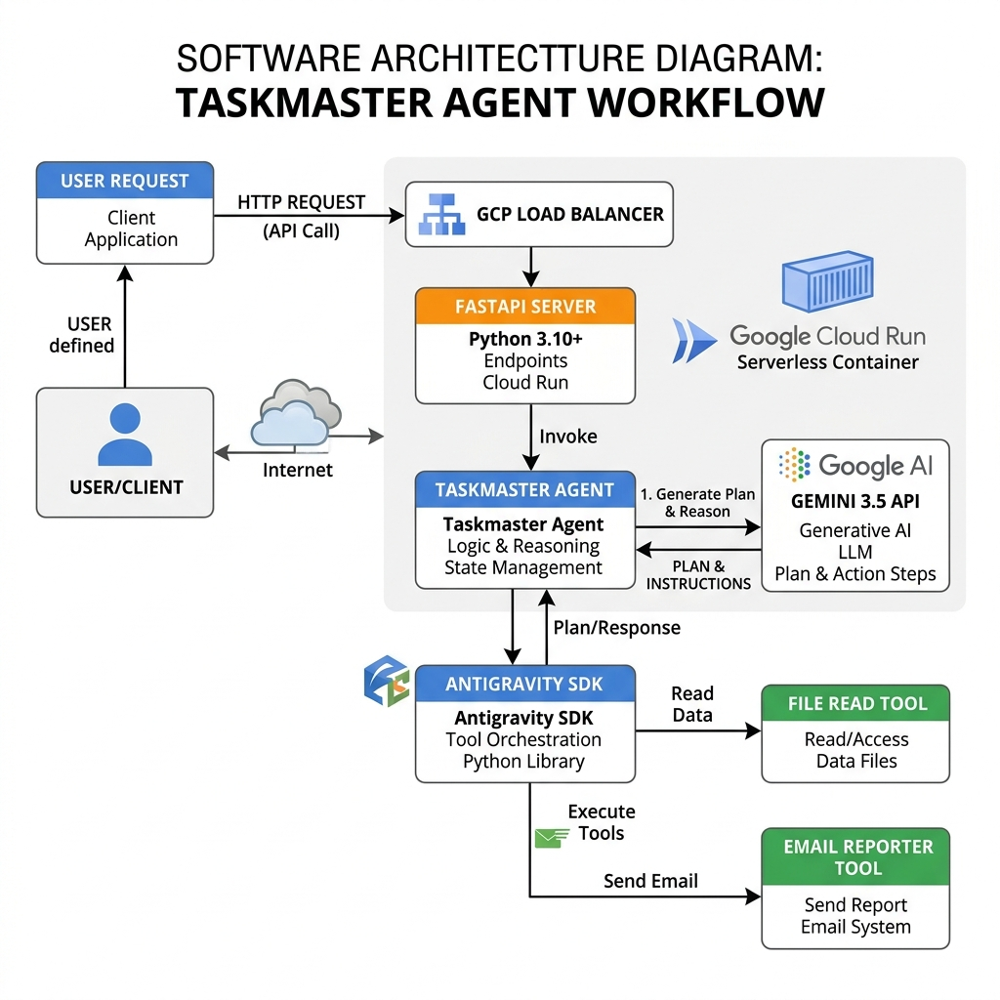

# Agentic Workflow Automation

A production-ready automated agentic workspace engine designed for the **Google All Things Agentic Hackathon**.

## 📌 Submission Overview
* **Track:** The Taskmaster (Orchestrated Workflow Automation)
* **Copyright Holder:** Fokrul Islam (MIT License)
* **Repository Link:** https://github.com/fokrulanthro16-eng/agentic-workflow-automation.git

---

## 🛠️ Tech Stack
* **LLM Engine:** Gemini 3.5 Flash / Gemini 2.5 Flash (via `google-genai` SDK)
* **Agentic Framework:** Antigravity Python SDK (`google-antigravity` programmatic agent leasing and tool capabilities)
* **Execution & Server:** FastAPI, Uvicorn, Python-dotenv
* **Deployment Target:** Google Cloud Run (Containerized execution)

---

## 🏗️ Architecture Overview

The system operates as a hybrid task executor. It decomposes ambiguous developer descriptions into structured execution paths and runs them programmatically inside isolated sandboxes.

You can inspect the full diagram specification in [`docs/architecture.mmd`](docs/architecture.mmd).



### High-Level Interaction Flow
```
                   +----------------------------------+
                   |       User / REST Client         |
                   +----------------------------------+
                                    |
                                    v (HTTP POST /run-workflow/)
                   +----------------------------------+
                   |         FastAPI Server           |
                   +----------------------------------+
                                    |
                                    v
                   +----------------------------------+
                   |        Taskmaster Agent          |
                   +----------------------------------+
                     /                              \
                    /                                \
  (1: Generate Plan)                                  (2: Lease Sandbox)
          v                                                    v
+-------------------------+                         +---------------------+
| Gemini 3.5 / 2.5 API    |                         |  Antigravity SDK    |
+-------------------------+                         +---------------------+
                                                       |
                                                       v (Trigger Tools)
                                            +------------------------------+
                                            | - FileReadTool               |
                                            | - EmailReporterTool          |
                                            | - fetch_api_data             |
                                            | - parse_csv_summary          |
                                            +------------------------------+
                                                       |
                                                       v (Query/Log state)
                                            +------------------------------+
                                            | - Project Workspace          |
                                            | - docs/sent_emails.log       |
                                            +------------------------------+
```

1. **Planning Interface:** When a task description is received, the `TaskAutomationAgent` calls the Gemini API to format a structured plan in Markdown.
2. **Autonomous Execution:** The plan is executed via the `google.antigravity` `Agent` context. The agent binds local OS capabilities (write files, execute commands) to accomplish the goals programmatically and outputs streamed execution thoughts.
3. **Telemetry & Serving:** A FastAPI server delivers endpoints to submit tasks and receive step-by-step progress streams.

---

## 🏆 Devpost / Harvard Submission Documentation

### 💡 Inspiration
Developers spend massive amounts of time reading logs, parsing data files, generating compliance reports, and writing alert dispatches. We wanted to build a sandboxed, production-ready AI task engineer that securely automates these developer workflows, providing a resilient pipeline that automatically falls back to secure API loops if local runtime binary configurations differ.

### ⚙️ What It Does
**Agentic Workflow Automation** executes multi-step background workflows through CLI and REST interfaces. Users submit prompts like *"Fetch the server metrics, format them, and email the report to the administrator."* The agent uses its tool capabilities (`FileReadTool`, `EmailReporterTool`, `fetch_api_data`, etc.) to execute the plan step-by-step, logging email traces locally and saving reports directly to the workspace.

### 🛠️ How We Built It
We implemented the system using:
- **FastAPI** to support streaming HTTP events and unified JSON workflows.
- **Antigravity SDK** for programmatic agent sandboxing and automated tool registry.
- **Google GenAI Python SDK** for live Gemini 3.5 / 2.5 Flash reasoning.
- **Python Unittest** to guarantee zero-defect operational statuses.

### 🚧 Challenges We Ran Into
- **Sandbox Boundary Validation:** Ensuring the agent tools could not perform directory-traversal exploits or modify files outside the workspace directories.
- **Resilient Fallbacks:** Constructing a multi-turn function-calling emulator for standard Gemini API instances when the local Antigravity binary workspace manager is absent.

### 🎉 Accomplishments Proud Of
- A robust, dual-mode execution strategy: runs seamlessly inside full Antigravity workspaces and falls back safely to pure API-driven loops elsewhere.
- 100% unit-test success rates covering fallback states, parameter checks, and tool executions.

### 🧠 What We Learned
We mastered programmatic agent leasing, multi-turn LLM loop orchestration, and automated schema generation using standard Python function metadata.

### 🔮 What's Next
- Deploying direct Google Cloud Run triggers to automate workflows in response to Cloud Pub/Sub events.
- Implementing fine-grained policy tools using declarative permission configuration sets.

---

## 🚀 Spin-up Instructions

### Prerequisites
* Python 3.10+
* Git
* A Google Gemini API key configured as `GEMINI_API_KEY`

### Local Quickstart

1. **Clone the repository:**
   ```bash
   git clone https://github.com/fokrulanthro16-eng/agentic-workflow-automation.git
   cd agentic-workflow-automation
   ```

2. **Install dependencies:**
   ```bash
   pip install -r requirements.txt
   ```

3. **Setup environment variables in `.env`:**
   ```ini
   GEMINI_API_KEY=your_gemini_api_key_here
   PORT=8080
   ```

4. **Run via CLI (Single Task Execution):**
   ```bash
   python src/main.py --task "Read workspace metrics and write a report."
   ```

5. **Run the FastAPI server:**
   ```bash
   python src/main.py --server
   ```

6. **Submit Task via endpoint /run-workflow/:**
   ```bash
   curl -X POST http://localhost:8080/run-workflow/ \
     -H "Content-Type: application/json" \
     -d '{"task": "Fetch the metrics and email report to fokrul@example.com"}'
   ```

---

## 🌐 Google Cloud Run Deployment

The project is configured for containerized deployment to Google Cloud Run using the `gcloud` CLI.

### Active Deployed Service
* **Live Service URL:** `https://agentic-workflow-automation-placeholder.a.run.app`

### Deployment Steps (via Cloud SDK Buildpack)

1. **Authenticate and configure your Google Cloud project:**
   ```bash
   gcloud auth login
   gcloud config set project your-gcp-project-id
   ```

2. **Deploy the application to Cloud Run:**
   This command automatically builds the container using Cloud Buildpacks based on the root `Dockerfile` and deploys it:
   ```bash
   gcloud run deploy agentic-workflow-automation \
     --source . \
     --region us-central1 \
     --allow-unauthenticated \
     --set-env-vars="GEMINI_API_KEY=your_actual_gemini_key"
   ```

3. **Verify Deployment:**
   Once finished, the CLI will output your Service URL. Replace the placeholder URL in this README with your live endpoint.
